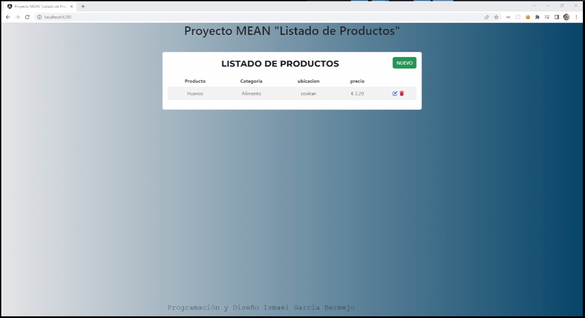

  <h1> Repositorio Proyectos MEAN Listado de Productos</h1>
  
  
  Author:
  <a href="https://www.linkedin.com/in/ismael-garc%C3%ADa-bermejo/" target="_blank">Ismael García Bermejo</a> 
  

 <h2>Currículum Code Por Ismael García Bermejo</h2>
    Rama:
  <a href="https://github.com/IsmaelGB86/Porta-Proyectos/tree/AngularList" target="_blank">AngularList</a>  
  

Pequeño Proyecto de Listado de Productos con Angular/bootstrap/toastr en el Frontend y Express/Mongo en el Backend.

 

## Listado de Productos:

<td>

<h4>Listado de Productos</h4>Proyecto MEAN (Angular-Express-Bootstrap-Mongo) Listado de productos en base de datos con CRUD de los articulos.

</td>
  
<a href="https://github.com/IsmaelGB86/Porta-Proyectos/tree/main/" target="_blank">Volver a Porta-Proyectos</a>
